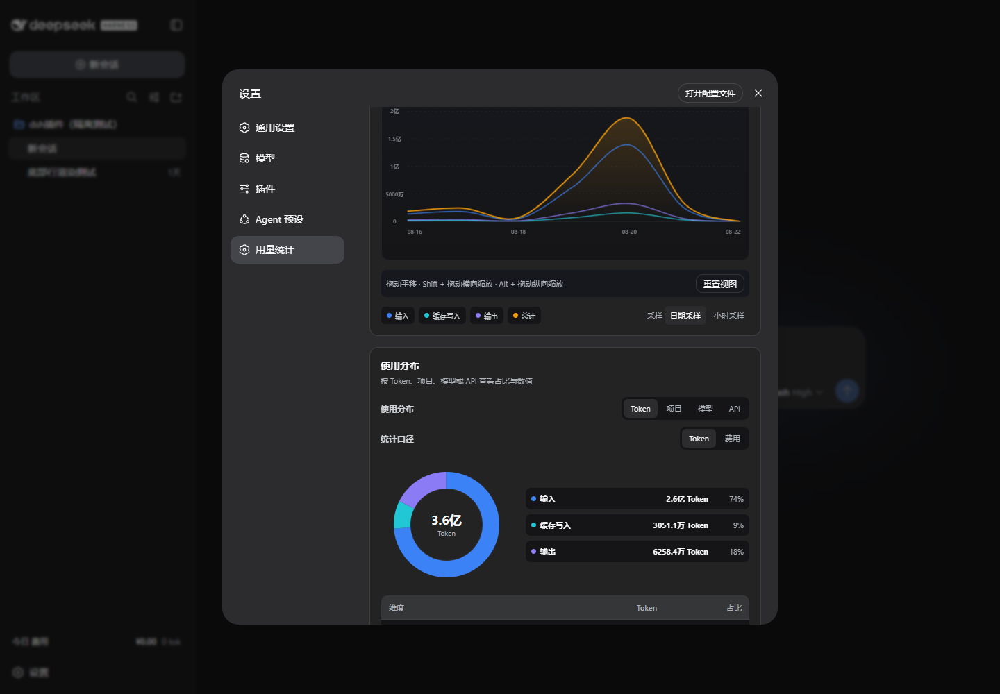

# DSH Cost Insights

[简体中文](README.md)

[](https://github.com/elviass/dsh-cost-insights/actions/workflows/ci.yml)
[](https://github.com/elviass/dsh-cost-insights/actions/workflows/codeql.yml)

A local usage and cost analytics plugin for DeepSeek Harness, covering tokens, cache activity, API balances, and model pricing.



## Features

- Filter usage and cost by conversation, workspace, model, API provider, purpose, and date range.
- Explore token, cost, and model activity through line charts, distribution charts, and a 365-day heatmap.
- Track input, cache writes, output, cache hit rate, and request count.
- Synchronize supported model prices and exchange rates, with CNY conversion for USD prices.
- Show balances from supported APIs and peak/off-peak prices for official DeepSeek calls.
- Extend the existing DSH composer statistics line and sidebar without replacing the original UI.
- Follow the DSH language and light/dark theme automatically.

## Install

1. Download `dsh-cost-insights-1.0.1.tgz` from the [v1.0.1 release](https://github.com/elviass/dsh-cost-insights/releases/tag/v1.0.1).
2. Install the downloaded archive for the appropriate DSH profile:

   ```console
   dsh plugin --profile web add ./dsh-cost-insights-1.0.1.tgz
   ```

> This project is distributed only through GitHub Releases. The former name
> `dsh-usage-insights` and the same-named npm package no longer identify this project.

When upgrading from v1.0.0, remove the old `dsh-usage-insights` package from the
profile before installing the renamed package. The ledger remains at
`storages/usage-insights/ledger.sqlite`, so the rename does not move or delete history.

## Usage

After installing and starting DSH, open **Settings → Cost Insights** for the full
dashboard. The line below the conversation composer shows current model pricing,
conversation cost, and supported API balances; the sidebar shows today's total cost.

In **More → About**, click the version seven times to export a sanitized diagnostic log.

## Compatibility

- DeepSeek Harness `>=0.1.0-rc.7 <0.2.0`
- Node.js `^22.19.0 || >=24.0.0`
- DSH web client

Version 1.0.1 retains the compatibility range validated for v1.0.0 with DSH
`0.1.0-rc.7` and `0.1.1-rc.2` in independent temporary `DSH_HOME` directories.

## Data and privacy

The plugin stores numeric usage metadata, provider and model identifiers, timestamps,
conversation/workspace grouping, price-source metadata, and optional balance snapshots
locally. It does not store prompts, response text, or raw API keys.

Network synchronization is limited to the pricing, exchange-rate, and balance endpoints
declared in `package.json`. Diagnostic exports remove credentials, prompts, response text,
and local database contents. Security concerns can be reported through GitHub's private
vulnerability reporting.

## License

MIT © 2026 elviass
